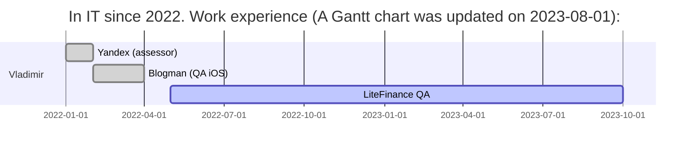

### Hi there 👋

**A-d-am/A-d-am** is a ✨ _special_ ✨ repository because its `README.md` (this file) appears on your GitHub profile.

Here are some ideas to get you started:

```mermaid
  gantt 
    title In IT since 2022. Work experience (A Gantt chart was updated on 2023-08-01):
    dateFormat  YYYY-MM
    section Vladimir
    Yandex (assessor)        :done, 2022-01, 2022-02
    Blogman (QA iOS)	  :done, 2022-02, 2022-04
    LiteFinance QA         :active, 2022-05, 2023-10
```
