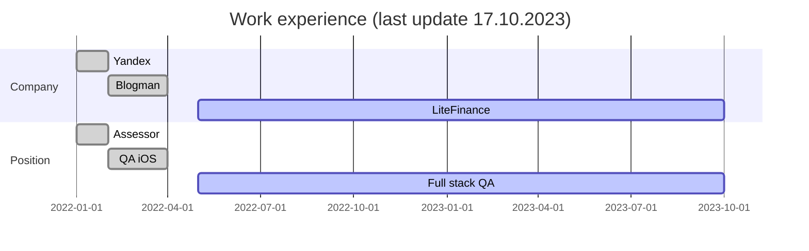
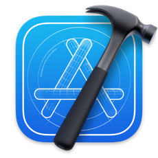

### <h1 align="center">Hi there, I'm <a href="https://github.com/A-d-am/" target="_blank">Vladimir</a> 👋</h1>

- More than 2 years in Quality Assurance 
- Automation QA since second half of 2023
- Python one love 
- Foosball guru 
- Bookworm 
- Contacts: 

<code></code>
<code></code>

    
<i>Work experience...</i>

<!-- Additional Work experience section -->
<!-- 
Work experience
 -->  
    

```mermaid
gantt
    title Work experience (last update 17.10.2023) 
    dateFormat YYYY-MM
     section Company
    Yandex       :done, 2022-01, 2022-02
    Blogman  :done, 2022-02, 2022-04
    LiteFinance         :active, 2022-05, 2023-10
    section Position
        Assessor :done, 2022-01, 2022-02
        QA iOS    :done, 2022-02, 2022-04
        Full stack QA :active, 2022-05, 2023-10
```

            
    

## 👨‍🎓Образование, курсы 
* qa.guru
* software-testing.ru
* Udemy    

## 💻Stack and tools

<code></code>
<code></code>
<code></code>
<code></code>
<code></code>

<code></code>
<code></code>
<code></code>
<code></code>

<code></code>
<code></code>
<code></code>
<code></code>
<code></code>

<code></code>
<code></code>
<code></code>
<code></code> 
<code></code>

<code></code>
<code></code>

      