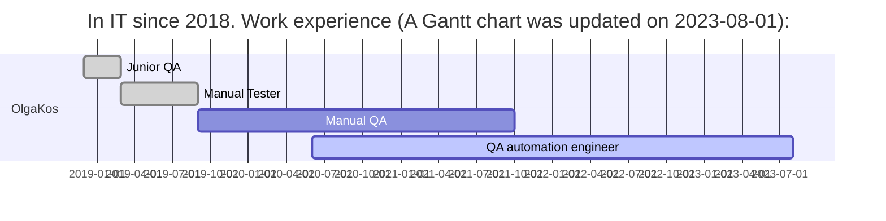

### Hi there 👋

**A-d-am/A-d-am** is a ✨ _special_ ✨ repository because its `README.md` (this file) appears on your GitHub profile.

Here are some ideas to get you started:

```mermaid
  gantt 
    title In IT since 2018. Work experience (A Gantt chart was updated on 2023-08-01):
    dateFormat  YYYY-MM
    section OlgaKos
    Junior QA         :done, 2018-12, 90d
    Manual Tester	  :done, 2019-03, 2019-09
    Manual QA         :after, 2019-09, 2021-10
    QA automation engineer     :active, 2020-06, 2023-08
```

